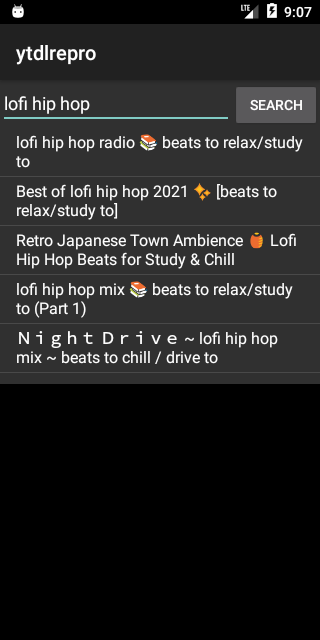
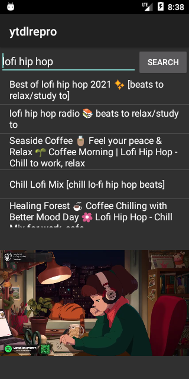

# Proof: yt-dlp-backed search → resolve → play (incl. live HLS) on Android 6.0 (API 23)

`apk-repro/` is a small but **interactive** yt-dlp-backed YouTube client: a search box + a
tappable results list + a video surface. Type a query → yt-dlp **searches** YouTube → tap a
result → yt-dlp **resolves** its stream → ExoPlayer **plays** it — all on an API-23 emulator.
On launch it auto-runs a default query and auto-plays the top hit, so the whole loop is also
verifiable headlessly (it writes `SEARCH_OK`/`RESOLVE_OK`/`PLAYBACK_OK` markers).

## The interactive client (screenshots, API-23 emulator)
Search results from on-device yt-dlp, then the tapped result playing — both on Android 6.0:

| Search results | Result playing |
|---|---|
|  |  |

**Genuine tap (not scripted):** with auto-play disabled (`--ez autoplay false`), a real `adb shell
input tap` on a list row drove playback. In the run shown, the search's *top* result was
"Best of lofi hip hop 2021" but the *tapped* row resolved + played "lofi hip hop radio" — a
different, non-zero index — so the result is the tapped item's, not index 0's. (`PLAYBACK_OK`,
ttf≈1.0 s.)

## Result
```
SEARCH_OK n=8  top='lofi hip hop radio 📚 beats to relax/study to'
   #2 Best of lofi hip hop 2021 ✨
   #3 Ｎｉｇｈｔ Ｄｒｉｖｅ ~ lofi hip hop mix
   #4 lofi hip hop mix 📚 (Part 1)
RESOLVE_OK playing='lofi hip hop radio …'
TIMING init=504ms search=2517ms resolve=2078ms
PLAYBACK_OK state=READY pos=7196336ms ttf=545ms   (live HLS — position = live edge)
```

## Latency (API-23 x86_64 emulator)
| phase | time | note |
|---|---|---|
| `init` | 504 ms | one-time CPython runtime start |
| `search` (`ytsearch8`) | 2517 ms | one full yt-dlp invocation |
| `resolve` (1 video) | 2078 ms | one full yt-dlp invocation |
| time-to-ready (ExoPlayer) | 545 ms | HLS manifest + initial buffer |

Tap-to-playing ≈ **resolve (~2 s) + buffer (~0.5 s) ≈ 2.5 s**. Usable, but each yt-dlp call
pays Python interpreter cold-start + a full extractor run — slower than native
NewPipeExtractor (sub-second). This is *the* practical tradeoff for "PipePipe/SmartTube could
just use yt-dlp": robustness/maintenance vs. per-call latency. Mitigations exist (a persistent
Python process, result caching, prefetch on hover) but aren't proven here.

## What it proves
- **Search** via `yt-dlp ytsearch8:<query> --flat-playlist --print` (on-device, API 23) → 8 real hits.
- **Resolve** the top hit via `getInfo -f …`; it was a **live** stream.
- **Play** via media3/ExoPlayer. The live stream is **HLS**, so the HLS renderer module was added
  (`media3-exoplayer-hls`, + `-dash`) → `PLAYBACK_OK state=READY`.

So the whole loop a NewPipe-style client performs — search, resolve, play (progressive **and**
live HLS) — runs on **yt-dlp on Android 6.0**. Combined with `proof/44` (progressive video) this
covers both the static and live paths.
