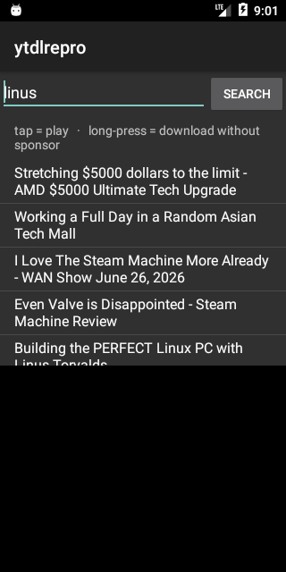

# Proof: one yt-dlp-backed client unifying BOTH goals on Android 6.0 (API 23)

`apk-repro` is now a single app that does both things this project set out to prove:

- **tap a result → play** it (yt-dlp resolve → ExoPlayer; progressive + live HLS) — `proof/44`, `proof/45`
- **long-press a result → download it with the sponsor cut out** (yt-dlp `--sponsorblock-remove`
  + bundled ffmpeg) — the original goal, now an in-client feature.



## In-app download run (API-23 emulator)
Search self-driven to a sponsor-heavy result, then the top hit downloaded without its sponsor
(`--es action download` makes the first search auto-trigger the long-press action for headless
verification; the long-press gesture is the human UX):
```
SEARCH_OK n=8 top='Stretching $5000 dollars to the limit - AMD $5000 Ultimate Tech Upgrade'
DOWNLOAD_OK segs=1 (sponsor cut) file=dl_2jMOVVNf2i8.m4a size=8876721 4384ms
```

## Verification
| | duration |
|---|---|
| original video (2jMOVVNf2i8) | 1511 s |
| expected after cutting the 52.4 s sponsor | ~1458.6 s |
| **in-app download `dl_2jMOVVNf2i8.m4a` (ffprobe)** | **1458.29 s** |

Identical to the standalone proof (`proof/46`) and the desktop reference — the sponsor segment is
physically gone from the file the client downloaded, on Android 6.0.

## Note on robustness
A first attempt long-pressed a multi-hour lofi mix; its "worstaudio" was 135 MB and ffmpeg's cut
ran the emulator out of disk (`Postprocessing: Conversion failed!`). That's an emulator storage
limit on an oversized pick, not a feature failure — verified by re-running on a normal-length video
with disk freed. Real clients would bound this (format caps / storage checks).
